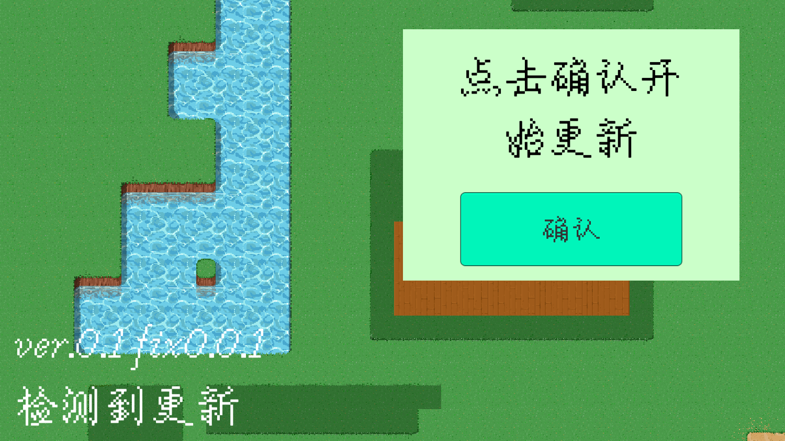
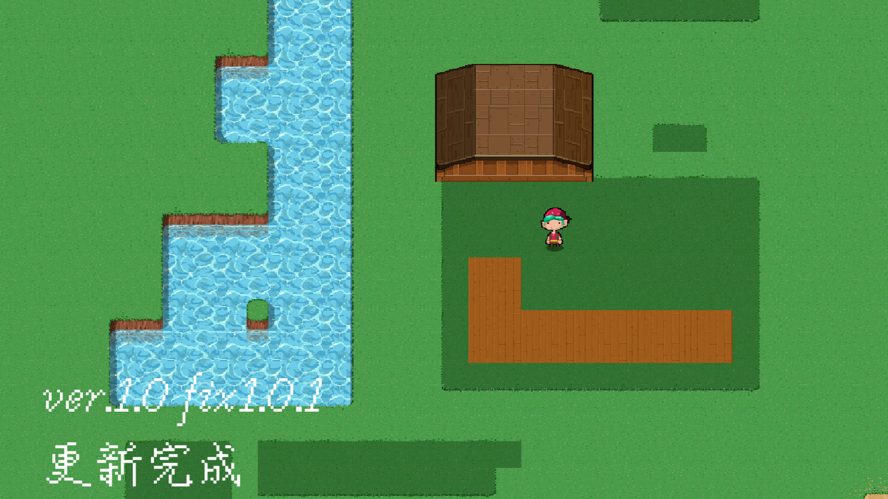
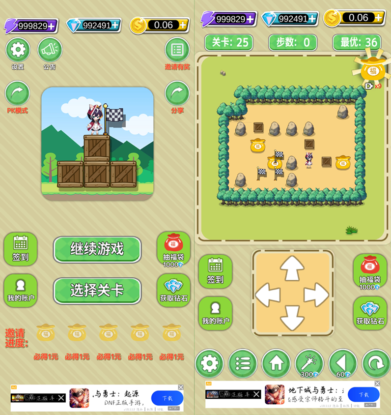
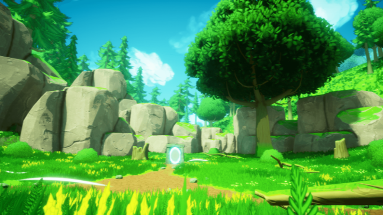

## UniLuaPatch

- 技术框架：***Unity3D、c#、lua、xLua、AssetBundle、UGUI、TextMeshPro、Newtonsoft Json***
- 使用xlua、AssetBundle等框架，完成了资产热更与c#代码热更，解决了项目更新维护困难问题。
- 对接口进行开发，探索服务定位器模式，代理模式等常用设计模式，增强了系统的灵活性和可维护性。

---

## 方块推推乐

- 技术框架：***git、Unity3D、c#、Mirror、UGUI、DoTween、MongoDB、WeChatSDK、TakuSDK***

- 

---

