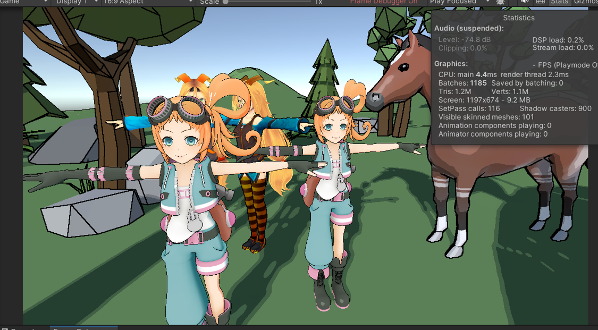
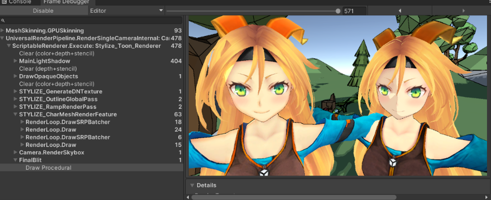
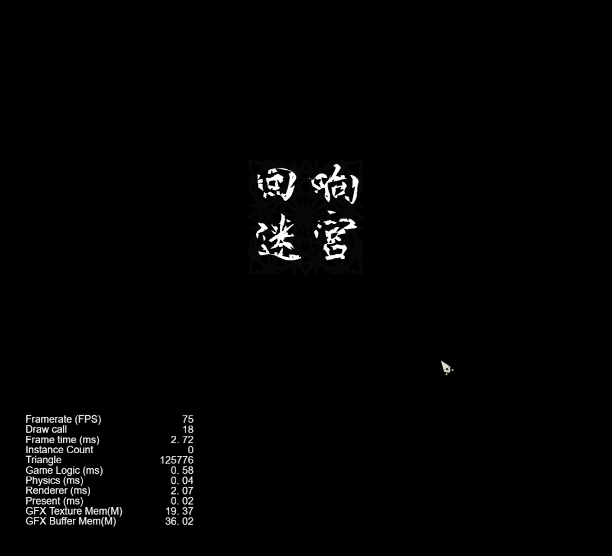

## UniLuaPatch

- 技术框架：***Unity3D、c#、lua、xLua、AssetBundle、UGUI、TextMeshPro、Newtonsoft Json***
- 使用xlua、AssetBundle等框架，完成了资产热更与c#代码热更，解决了项目更新维护困难问题。
- 对接口进行开发，探索服务定位器模式，代理模式等常用设计模式，增强了系统的灵活性和可维护性。

---

## 方块推推乐

- 技术框架：***git、Unity3D、c#、Mirror、UGUI、DoTween、MongoDB、WeChatSDK、TakuSDK***

- 编译WeChatSDK导入到Unity中，实现了应用微信登录，微信分享，返现到微信零钱功能，提升了用户体验与操作便捷性。

- 使用Mirror插件，实现玩家联机功能，pk闯关功能等，增加游戏趣味性。

---

## 风格化SRP管线开发

- 技术框架：***Unity3D、c#、HLSL、URP、ScriptableRenderFeature、ShaderLab、SRPBatcher***
- 通过URP可编程的特性，完成场景描边、着色Pass与角色描边、着色Pass的分离，提高了渲染效率。
- 使用HLSL语言与ShaderLab框架，结合常用的描边着色算法，完成了风格化Shader开发。

---

## 回响迷宫

- 视频链接：https://zhuanlan.zhihu.com/p/679806845

- 使用Cocos开发，这个游戏的玩法是将听觉可视化，然后躲避怪物，逃出迷宫。

---

## 关我命运

- 视频链接：https://zhuanlan.zhihu.com/p/679806845
- 使用UnrealEngine开发，利用引擎各个系统，完成地形制作，场景搭建，灯光渲染烘焙，后期处理等风格化效果制作。

